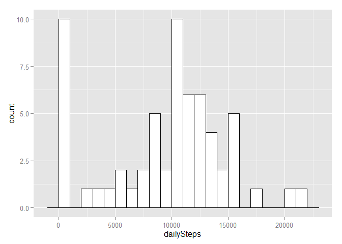
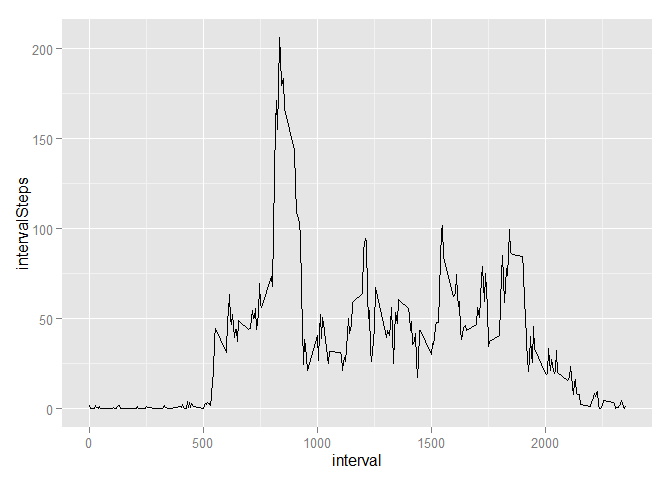
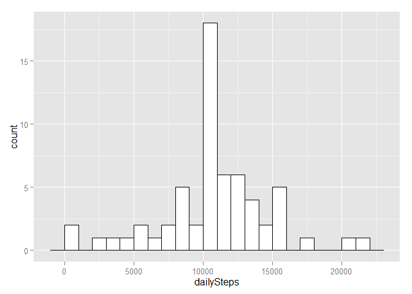
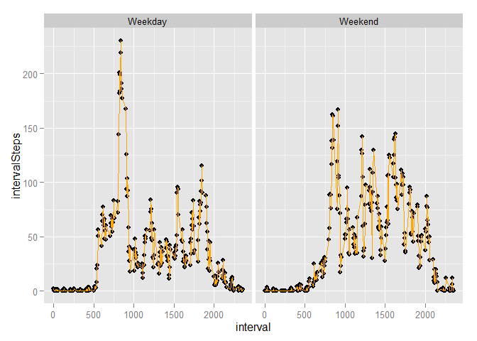

# Reproducible Research: Peer Assessment 1


## Loading and preprocessing the data


```r
# setwd("E:/Users/Hal/Documents/GitHub/R/Reproducible Research/Project 1/Reproducible-Research-Project-One/RepData_PeerAssessment1")
library(data.table)
library(ggplot2)
# Load activity monitoring data
fileNameTxt <- "activity.csv"
if (!file.exists(fileNameTxt))
{  urlTxt <- "https://d396qusza40orc.cloudfront.net/repdata%2Fdata%2Factivity.zip"
   zipNameTxt <- "repdata-data-activity.zip"
   if (!file.exists(zipNameTxt))
   {  download.file(urlTxt, destfile = zipNameTxt)
   }
   unzip(zipNameTxt)
}
activityData <- read.csv(file=fileNameTxt, header=TRUE, sep=",")
activtyDt <- data.table(activityData)
```

## What is mean total number of steps taken per day?

```r
stepsDt <- activtyDt[, list(dailySteps=sum(na.omit(steps))), by = date]
ggplot(stepsDt, aes(x=dailySteps))  + geom_histogram(binwidth=1000, col="black", fill="white")
```

 

```r
meanOfDailySteps <- stepsDt[,mean(dailySteps),]
ln1 <- paste("The mean steps per day = ", meanOfDailySteps)
medianOfDailySteps <- stepsDt[,median(dailySteps),]
ln2 <- paste("The median steps per day = ", medianOfDailySteps)
writeLines(c(ln1, ln2))
```

```
## The mean steps per day =  9354.22950819672
## The median steps per day =  10395
```
## What is the average daily activity pattern?

```r
intervalDt <- activtyDt[, list(intervalSteps=mean(na.omit(steps))), by = interval]
ggplot(intervalDt, aes(interval,intervalSteps)) + geom_line()
```

 

```r
maxAvgStepsDt <- intervalDt[which.max(intervalSteps),]
paste("Interval ", maxAvgStepsDt$interval[1], " has the maximum average steps of ", maxAvgStepsDt$intervalSteps[1])
```

```
## [1] "Interval  835  has the maximum average steps of  206.169811320755"
```
## Imputing missing values

```r
isMissing <- is.na(activtyDt$steps)
isMissingCt <- sum(isMissing)
totalCt <- length(activtyDt$steps)
ln3 <- paste(isMissingCt,"values are missing out of a total of", totalCt)
ln4 <- paste("In other words, ", 100.0 * isMissingCt / totalCt, "% of the values are missing.")
writeLines(c(ln3, ln4))
```

```
## 2304 values are missing out of a total of 17568
## In other words,  13.1147540983607 % of the values are missing.
```

```r
setkey(intervalDt, "interval")
setkey(activtyDt, "interval")
activtyAdjDt <- activtyDt[intervalDt][is.na(steps),steps:=as.integer(round(intervalSteps))][,intervalSteps:=NULL]
stepsAdjDt <- activtyAdjDt[, list(dailySteps=sum(na.omit(steps))), by = date]
ggplot(stepsAdjDt, aes(x=dailySteps))  + geom_histogram(binwidth=1000, col="black", fill="white")
```

 

```r
meanOfDailyStepsAdj <- stepsAdjDt[,mean(dailySteps),]
ln5 <- paste("The adjusted mean steps per day = ", meanOfDailyStepsAdj, "versus", meanOfDailySteps, "unadjusted")
meanAdjImpact <- (meanOfDailyStepsAdj - meanOfDailySteps) / meanOfDailySteps;
ln6 <- paste("The imputed values increase the mean by", 100 * meanAdjImpact, "%")
medianOfDailyStepsAdj <- stepsAdjDt[,median(dailySteps),]
ln7 <- paste("The adjusted median steps per day = ", medianOfDailyStepsAdj, "versus", medianOfDailySteps, "unadjusted")
medianAdjImpact <- (medianOfDailyStepsAdj - medianOfDailySteps) / medianOfDailySteps;
ln8 <- paste("The imputed values increase the median by", 100 * medianAdjImpact, "%")
writeLines(c(ln5, ln6, ln7, ln8))
```

```
## The adjusted mean steps per day =  10765.6393442623 versus 9354.22950819672 unadjusted
## The imputed values increase the mean by 15.0884670386675 %
## The adjusted median steps per day =  10762 versus 10395 unadjusted
## The imputed values increase the median by 3.53054353054353 %
```
## Are there differences in activity patterns between weekdays and weekends?

```r
invisible(activtyAdjDt[, isWeekend := weekdays(as.Date(date))=="Saturday" | weekdays(as.Date(date))=="Sunday"])
intervalAdjDt <- activtyAdjDt[, list(intervalSteps=mean(na.omit(steps))), by = list(interval, isWeekend)][,weekdayCatg := ifelse(isWeekend, "Weekend", "Weekday")][,isWeekend:=NULL];
ggplot(intervalAdjDt, aes(interval, intervalSteps))+geom_point(color="black")+facet_wrap(~weekdayCatg, ncol=2)+geom_line(color="orange")
```

 
